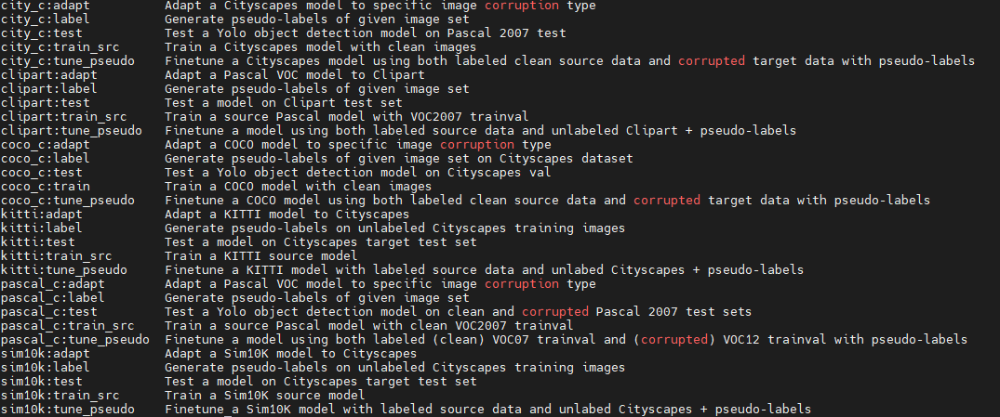

# EBCDet: Energy-Based Curriculum for Robust Domain Adaptive Object Detection

This repository contains code and detailed instructions to help reproduce the experiment results of our EBCDet paper. 

EBCDet builds on our previous work SimROD (ICCV 2021 Oral paper, see [here](README_simrod.md) & [here](https://github.com/abanitalebi/simrod)).


## Development Environment
We employ PyTorch for the training and inference scripts and leverage [GuildAI](https://guild.ai/) ML experiment management tool to streamline the experiments and easily reproduce the results.

The code is tested on the following library versions (on Ubuntu & Win7), but there is no reason for it not to work on newer versions of PyTorch.

- PyTorch 1.8.0 (with Python 3.7.10, CudaToolkit 11.1, Cudnn 8.0)
- imagecorruptions: for preparing the image corruption datasets
- guildai: for managing and tracking the experiments
- omegaconf: for configuring the experiments

```
conda create -n yolo python=3.7
conda install pytorch==1.8.0 torchvision==0.9.0 cudatoolkit=11.1 -c pytorch
pip install imagecorruptions
pip install omegaconf
pip install guildai==0.7.4
pip install tidecv
pip install pycocotools==2.0.2
pip install matplotlib
conda install tqdm
pip install scikit-image==0.18.1
pip install streamlit
pip install pandas
```


### Testing the GuildAI installation

Run the command `guild ops` to display all the available operations that are used to run the experiments. 

```
$ guild ops
```

If the installation is successful, you should see a screenshot as shown below:




The following operation prefixes are used to distinguish the configurations of diffent benchmark experiments:

- sim10k:  Sim10K -> Cityscapes
- kitti: KITTI -> Cityscapes
- clipart: VOC -> Clipart
- water: VOC -> Watercolor
- comic: VOC -> Comic
- pascal_c: Pascal-C image corruption
- coco_c: COCO-C image corruption
- city_c: Cityscapes-C image corruption

For each of the above models, there are 5 different operations: 

1. train_src: Train a source model
2. adapt: Adapt a model using given checkpoint for generating pseudo-labels
3. tune_pseudo: Finetune a model using source data and unlabeled target data with given pseudo-label directory
4. test: Evaluate the model on source and target test sets
5. label: Label a given set of unlabeled target training data.

An operation is specified by the model prefix and the operation name as `<MODEL_PREFIX>:<OPERATION_NAME>` (e.g. `sim10k:train_src` or `kitti:adapt`).

The flags for each operation are pre-configured in the file `guild.yml`. For each operation, the `data` flag value is set to read the data configuration specific to that operation. All data configurations are defined in the`/data/` folder.
Note that the operation defined in `guild.yml` file also specify default flag values that override the data configuration parameters. It is still possible to override the flag as will be shown in the next section.

More information on how to use GuildAI can be found in the official [documentation](https://my.guild.ai/t/guild-ai-documentation/64). 

### Testing the code

We can also test the code by running inference on images in folder `inference/images` using the adapted model in the runs folder `runs/watercolor-5s-adapted`.

```
python detect.py --weights="./runs/watercolor-adapted-5s-416/outputs/weights/best.pt"
```

Check that the model inference completes and the predictions are saved in `inference/outputs`.


## Run EBCDet adaptation process

Let's use the `Pascal -> Comic` adaptation experiment as an example. To complete one full experiment on a given benchmark, we need to follow three simple steps.
First, we need to train the source models for student and teacher. Second, we adapt the large teacher model. Third, we apply the teacher-guided finetuning to adapt the student source model.

These 3 steps translate to running four GuildAI operations as described below.

### Step 1: Training a student and a teacher source models using Pascal training data

To train a student source Pascal model with 2 GPUs with default batch size of 128 and input size 416, we simply run the following operation:

```
guild run pascal:train_src cfg=models/yolov5s.yaml device=0,1 output_run_dir=pascal-source-5s-416
```

> Note that the training parameters and data configurations are already set in the operation `pascal:train_src` in `guild.yml` file. 

To train a large teacher model X1280 (i.e. Yolov5x model with input size of 1280) on Pascal training data, we run same operation with different configuration:

```
guild run pascal:train_src cfg=models/yolov5x.yaml device=0,1,2,3 bs=64 img_size=1280 output_run_dir=pascal-source-5x-1280
```

These commands will save the outputs of each training job in the subdirectory specified by `output_run_dir` within the `GUILD_HOME/runs` root directory.

> Note: Alternative to guild, one can also directly use the python training scripts, e.g. 'python train.py' and set the arguments with argparse or command-line.


### Step 2: Adapt a large teacher X1280 to Comic dataset using EBCDet (self-adaptation)

To adapt the source teacher model `pascal-source-5x` to Comic, we run the `pascal:adapt` operation as follows:

```
guild pascal:adapt cfg=models/yolov5x.yaml warmup_epochs=50 finetune_epochs=150 img_size=1280 label_img_size=1280 /
      ckpt_run_id=pascal-source-5x-1280 pseudo_run_id=pascal-source-5x-1280 device=0,1,2,3 bs=64 /
      output_run_id=pascal-adapted-5x-1280
```

> Note: Alternatively, we can directly use 'python adapt.py'.

### Step 3: Finetune the student model using teacher-guided pseudolabels

```
guild pascal:tune_pseudo cfg=models/yolov5s.yaml ckpt_run_id=pascal-source-5s-416 pseudo_run_id=pascal-adapted-5x-1280 /
      output_run_id=pascal-adapted-5s-416
```

> Note: You can also use the  'adapt.py' script for all the processes. Just make sure to set the 'teacher-adapt' and 'run-id' flags correctly.

## Evaluate the adapted student model on source and target test sets

```
guild run pascal:test cfg=models/yolov5m.yaml ckpt_run_id=pascal-adapted-5s-416
```


## Datasets, Checkpoints, etc.

- Datasets: Instructions on how to prepare the datasets and how to generate image corruption datasets are available [here](preparing_data.md). We have made available a direct link to download sample VOC & Comic datasets for ease of use and access [here](https://modelarts-cnnorth1-market-dataset.obs.cn-north-1.myhuaweicloud.com/example-apps/simrod/data.zip) (You can unzip them in ./datasets directory).
- Checkpoints: There can be a large number of checkpoints for all the experiments. We provide example checkpoints to try the code with. For many experiments, we use COCO pre-training to train source models, and its checkpoint can be obtained at [here](https://zenodo.org/record/3908560#.YQFyv45Kj-g) or [here](https://modelarts-cnnorth1-market-dataset.obs.cn-north-1.myhuaweicloud.com/example-apps/simrod/coco_checkpoints.zip). Download and copy COCO checkpoints into the root folder of code directory. Example source trained Yolo models can also be obtained via [this](https://modelarts-cnnorth1-market-dataset.obs.cn-north-1.myhuaweicloud.com/example-apps/simrod/src_models.zip) link (these are needed for the adaptation experiments). Download and copy these checkpoints into ./runs directory.


## Potential code issues and solutions:
- 'broken pipe'; 'page file is not large enough' -> lower number of workers to reduce the memory usage
- 'RuntimeError: cuDNN error: CUDNN_STATUS_INTERNAL_ERROR' -> lower the memory usage, e.g. close other apps & lower nw
- GPU OOM -> lower the batch size

