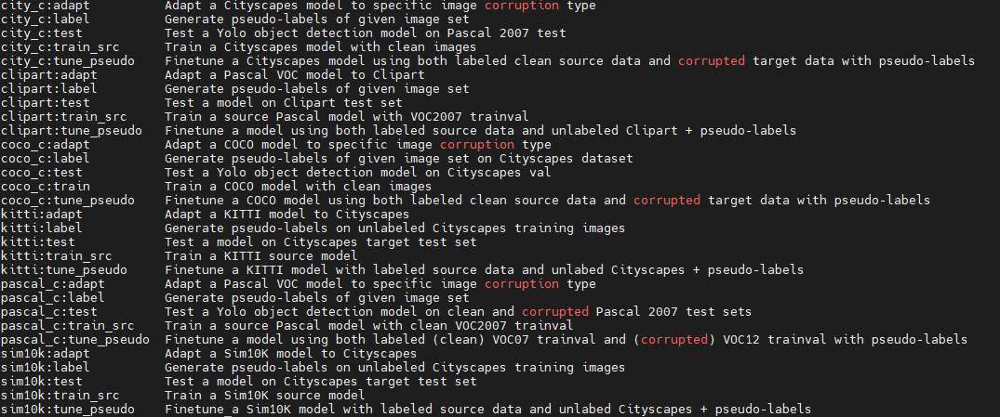

# SimROD: a Simple adaptation method for Robust Object Detection

Here, we provide detailed instructions to help replay our experiments. To make it easy to reproduce our research results, we leverage the [ML experiment management tool GuildAI](https://guild.ai/).
In this documentation, we give an overview of the environment installation and adaptation experiment.

## Environment installation

Install the environment using [pip installation](installation.md). 

### Testing the GuildAI installation

Run the command `guild ops` to display all the available operations that are used to run the experiments. 

```
$ guild ops
```

If the installation is successful, you should see a screenshot as shown below:




The following operation prefixes are used to distinguish the configurations of diffent benchmark experiments:

- sim10k:  Sim10K -> Cityscapes
- kitti: KITTI -> Cityscapes
- clipart: VOC -> Clipart
- water: VOC -> Watercolor
- comic: VOC -> Comic
- pascal_c: Pascal-C image corruption
- coco_c: COCO-C image corruption
- city_c: Cityscapes-C image corruption

For each of the above models, there are 5 different operations: 

1. train_src: Train a source model
2. adapt: Adapt a model using given checkpoint for generating pseudo-labels
3. tune_pseudo: Finetune a model using source data and unlabeled target data with given pseudo-label directory
4. test: Evaluate the model on source and target test sets
5. label: Label a given set of unlabeled target training data.

An operation is specified by the model prefix and the operation name as `<MODEL_PREFIX>:<OPERATION_NAME>` (e.g. `sim10k:train_src` or `kitti:adapt`).

The flags for each operation are pre-configured in the file `guild.yml`. For each operation, the `data` flag value is set to read the data configuration specific to that operation. All data configurations are defined in the`/data/` folder.
Note that the operation defined in `guild.yml` file also specify default flag values that override the data configuration parameters. It is still possible to override the flag as will be shown in the next section.

More information on how to use GuildAI can be found in the official [documentation](https://my.guild.ai/t/guild-ai-documentation/64). 

### Testing the code

We can also test the code by running inference on images in folder `inference/images` using the adapted model in the runs folder `runs/watercolor-5s-adapted`.

```
python detect.py --weights="./runs/watercolor-adapted-5s-416/outputs/weights/best.pt"
```

Check that the model inference completes and the predictions are saved in `inference/outputs`.


## Run SimROD adaptation process

We use the `Sim10K -> Cityscapes` adaptation experiment as example. To complete one full experiment on a given benchmark, we need to follow three simple steps.
First, we need to train the source models for student and teacher. Second, we adapt the large teacher model. Third, we apply the teacher-guided finetuning to adapt the student source model.

These 3 steps translate to running four GuildAI operations as described below.

### Step 1: Training a student and a teacher source models using Sim10K training data

To train a student source Sim10K model with 2 GPUs with default batch size of 128 and input size 416, we simply run the following operation:

```
$ guild sim10k:train_src cfg=models/yolov5m.yaml device=0,1 output_run_dir=sim10k-source-5m-416
```

> Note that the training parameters and data configurations are already set in the operation `sim10k:train_src` in `guild.yml` file. 

To train a large teacher model X1280 (i.e. Yolov5x model with input size of 1280) on Sim10K training data, we run same operation with different configuration:

```
$ guild sim10k:train_src cfg=models/yolov5x.yaml device=0,1,2,3 bs=64 img_size=1280 output_run_dir=sim10k-source-5x-1280
```

These commands will save the outputs of each training job in the subdirectory specified by `output_run_dir` within the `GUILD_HOME/runs` root directory.


### Step 2: Adapt a large teacher X1280 to Cityscapes using SimROD (self-adaptation)

To adapt the source teacher model `sim10k-source-5x` to Cityscapes, we run the `sim10k:adapt` operation as follows:

```
$ guild sim10k:adapt cfg=models/yolov5x.yaml warmup_epochs=50 finetune_epochs=150 img_size=1280 label_img_size=1280 /
                     ckpt_run_id=sim10k-source-5x-1280 pseudo_run_id=sim10k-source-5x-1280 device=0,1,2,3 bs=64 /
                     output_run_id=sim10k-adapted-5x-1280
```

### Step 3: Finetune the student model using teacher-guided pseudolabels

```
$ guild sim10k:tune_pseudo cfg=models/yolov5m.yaml ckpt_run_id=sim10k-source-5s-416 pseudo_run_id=sim10k-adapted-5x-1280 /
                           output_run_id=sim10k-adapted-5s-416
```

## Evaluate the adapted student model on source and target test sets

```
guild sim10k:test cfg=models/yolov5m.yaml ckpt_run_id=sim10k-adapted-5s-416
```

## Pretrained models

We share the small Yolov5s source model pretrained on Pascal-VOC in `./runs/pascal-source-5s-416`. Other source model checkpoints will be made available later due to size limit and to keep our submission. 

All prepared dataset labels in YOLO format for all experiments will be made available later.

## Other documentations

Instructions on how to prepare the datasets and how to generate image corruption datasets are available [here](preparing_data.md).

Furthermore, we release the code and instructions on [how to run the demo app](running_demo.md). However, pretrained models are needed to run the demo. Meanwhile, a video of the demo app is provided as part of our supplementary materials.

